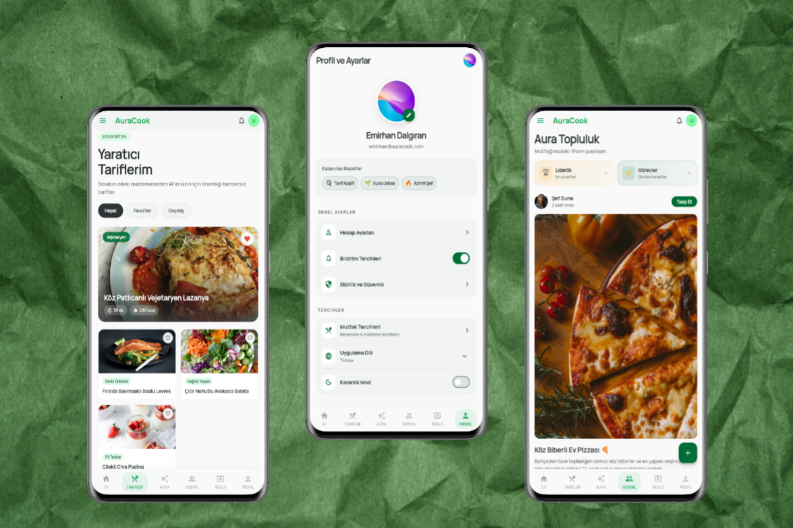
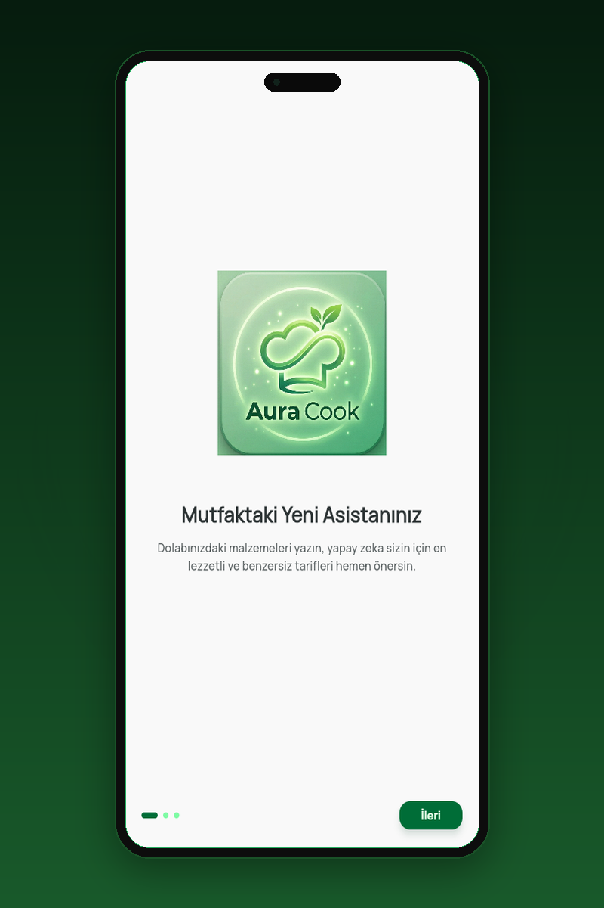
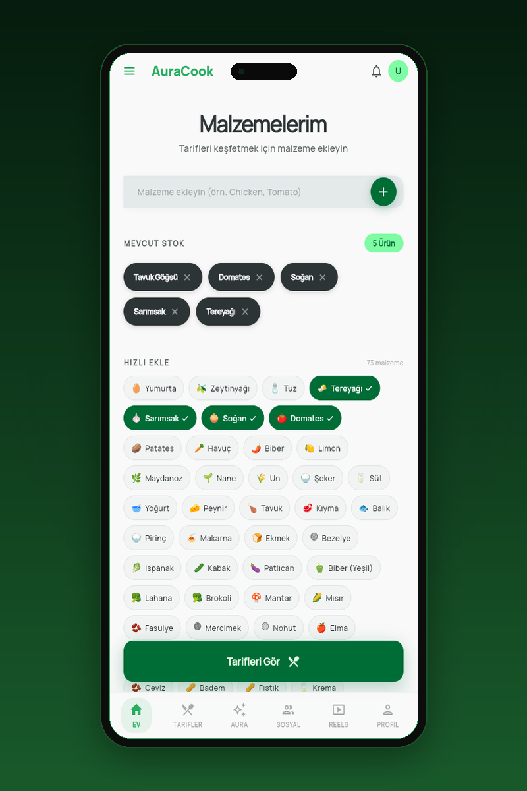
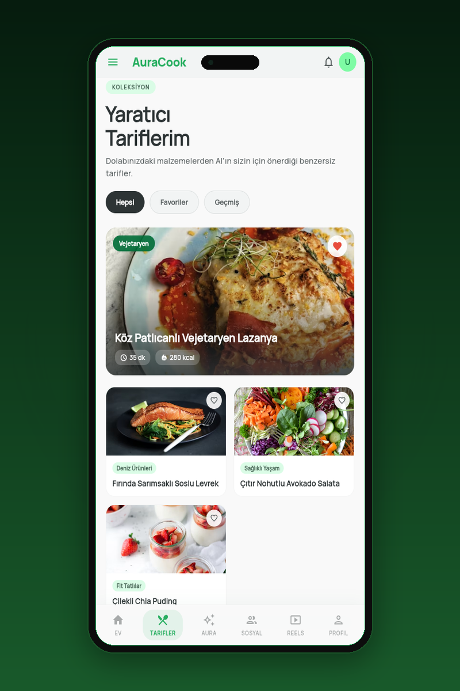
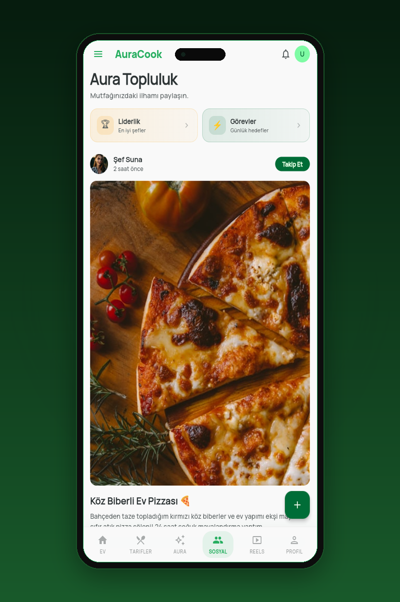
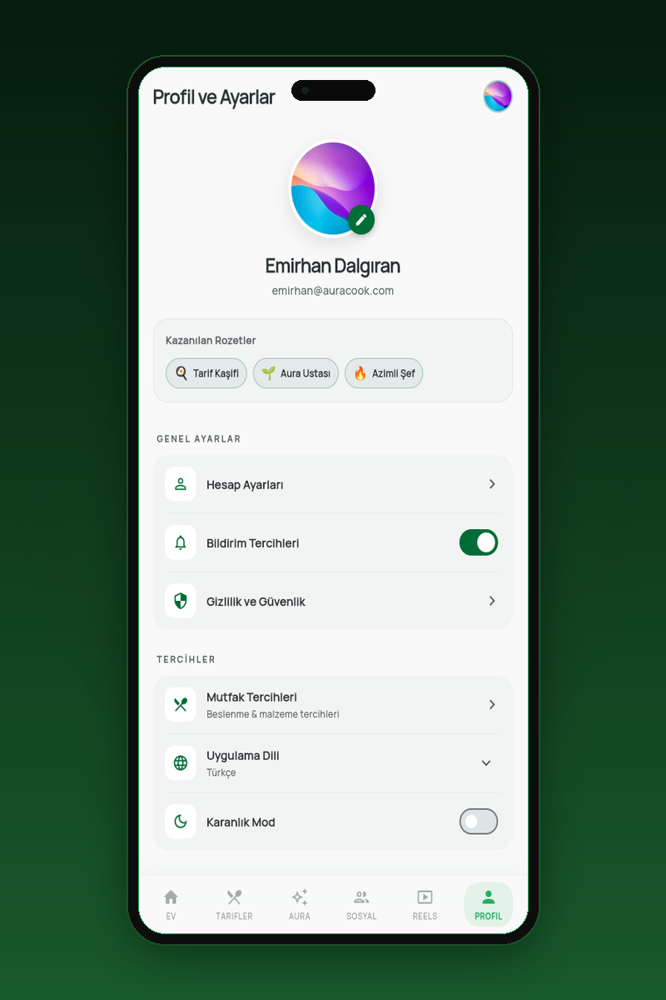
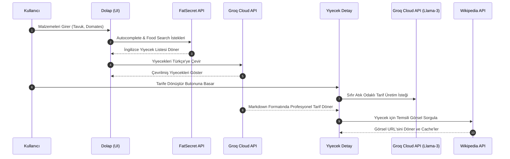

# 🍳 AuraCook: Akıllı & Sürdürülebilir Mutfak Yönetim Asistanı

[](https://flutter.dev)
[](https://dart.dev)
[](https://riverpod.dev)
[](https://pub.dev/packages/hive)
[](https://groq.com)
[](STELLAR_ACADEMIC_DOCUMENTATION.md)



> **Topkapı Üniversitesi - PP214: Programlamada Yeni Eğilimler & BTE208: Bilgisayar Teknolojilerinde Güncel Trendler Dersi Final Projesi**
> 
> **Geliştirici:** Cebrail Emirhan Dalgıran (Öğrenci No: 24010501018)
> 
> Evsel gıda israfını sıfırlamak ve mutfak alışkanlıklarınızı daha sürdürülebilir, reaktif ve eğlenceli hale getirmek için tasarlanmış, yapay zekâ destekli ve oyunlaştırma (gamification) odaklı Enterprise (Kurumsal) düzeyde mobil uygulama ekosistemi.

---

## 📱 Uygulama Ekran Görüntüleri

AuraCook'un modern, temiz ve sürdürülebilirlik odaklı Material 3 arayüzünü aşağıdaki profesyonel tanıtım kartlarından inceleyebilirsiniz:

| 🌟 Sıfır Atık Hareketi | 🏠 Akıllı Dolap Yönetimi | 👨‍🍳 Yapay Zekâ Şefi |
| :---: | :---: | :---: |
| [](assets/images/auracook_promo_onboarding.png) | [](assets/images/auracook_promo_smart_fridge.png) | [](assets/images/auracook_promo_ai_chef.png) |
| **Giriş & Onboarding**<br>Mutfakta israfı sıfırlayan akıllı karşılama ve onboarding deneyimi. | **Akıllı Malzeme Takibi**<br>Dolabınızdaki malzemeleri emoji chipleriyle pratik ve reaktif izleyin. | **Sıfır Atık Tarifler**<br>Seçtiğiniz malzemelerle Groq Llama-3 destekli anlık ve sağlıklı tarifler. |

| 💬 Topluluk & Sosyal Medya | 📈 Ekolojik Etki & Başarı |
| :---: | :---: |
| [](assets/images/auracook_promo_social.png) | [](assets/images/auracook_promo_eco_impact.png) |
| **Aura Topluluk Akışı**<br>Mutfağınızdaki gıda kurtarma ilhamını diğer şeflerle paylaşın ve etkileşim kurun. | **Karbon & Rozet Takibi**<br>Çöpe gitmekten kurtardığınız gıdaların karbon tasarrufunu izleyin ve rozetler kazanın. |

---


## 📖 İçindekiler (Table of Contents)

1. [🌟 Proje Hakkında ve Motivasyon](#-proje-hakkında-ve-motivasyon)
2. [📱 Sayfa Sayfa Uygulama Haritası ve Özellikler](#-sayfa-sayfa-uygulama-haritası-ve-özellikler)
3. [🔌 Entegre API Servisleri ve Veri Akışı](#-entegre-api-servisleri-ve-veri-akışı)
4. [🛠️ Gelişmiş Mimari ve Teknoloji Yığını](#%EF%B8%8F-gelişmiş-mimari-ve-teknoloji-yığını)
5. [📊 Akademik Ekolojik Etki & Oyunlaştırma Matematik Modeli](#-akademik-ekolojik-etki--oyunlaştırma-matematik-modeli)
6. [🚀 Tek Tıkla Kurulum ve Çalıştırma (1-Click Run & Deploy)](#-tek-tıkla-kurulum-ve-çalıştırma-1-click-run--deploy)
7. [🔒 API Güvenliği ve Ortam Değişkenleri (.env)](#-api-güvenliği-ve-ortam-değişkenleri-env)
8. [📂 Proje Klasör Yapısı (Clean Architecture)](#-proje-klasör-yapısı-clean-architecture)
9. [📘 Akademik Dokümantasyon](#-akademik-dokümantasyon)

---

## 🌟 Proje Hakkında ve Motivasyon

Birleşmiş Milletler Çevre Programı (UNEP) verilerine göre küresel olarak üretilen gıdaların yaklaşık %40'ı tüketilmeden çöpe gitmektedir. Çöpe atılan her gıda, yalnızca ekonomik bir kayıp değil; üretim, lojistik ve soğutma zincirinde harcanan su, toprak ve enerji kaynaklarının da israf edilmesi demektir.

**AuraCook**, evsel gıda yönetimini optimize etmek, sürdürülebilir mutfak alışkanlıkları kazandırmak ve gıda israfının karbon ayak izini azaltmak amacıyla geliştirilmiş akademik ve pratik bir çözümdür. Kullanıcının dolabındaki malzemeleri takip etmesini sağlar, bu malzemelerden **üretken yapay zekâ (LLM)** yardımıyla sıfır atık odaklı tarifler üretir ve eller serbest ses motoruyla pişirme sürecini asiste eder.

---

## 📱 Sayfa Sayfa Uygulama Haritası ve Özellikler

AuraCook, 14+ ekrandan oluşan zengin ve modern tasarımıyla kullanıcılara bütünsel bir **Super App** deneyimi sunar:

### 🔐 1. Giriş, Kayıt ve Karşılama Ekranları (Auth & Onboarding)
*   **Yetkilendirme:** Firebase Auth entegrasyonuyla güvenli giriş ve kayıt sistemleri.
*   **Kullanıcı Arayüzü:** `flutter_animate` ile hazırlanan premium staggered giriş animasyonları ve şık kart tasarımları.
*   **Onboarding:** Kullanıcıya uygulamanın sıfır atık felsefesini ve sürdürülebilirlik vizyonunu anlatan interaktif tanıtım akışı.

### 🏠 2. Anasayfa & Akıllı Dolap (Aura Dolabım)
*   **Malzeme Girişi:** Kullanıcıların dolaplarında bulunan malzemeleri tek tek veya hızlı ekleme listesinden ekleyebileceği reaktif bir arayüz.
*   **Hızlı Ekle Paneli:** Mutfaklarda en çok bulunan 70 popüler malzemenin (yumurta, domates, un, tavuk vb.) tek tıkla eklenmesini sağlayan dinamik emoji chipleri.
*   **Akıllı Autocomplete:** FatSecret API'si üzerinden harf girildiği anda eşzamanlı çalışan, yapay zekâ ile Türkçe'ye çevrilen akıllı malzeme tamamlama sistemi.

### 🔍 3. Besin Arama & Ayrıntılı Liste (Food Search Results)
*   **API Tabanlı Arama:** Girilen malzemelerden en mantıklı arama kombinasyonunu oluşturan ve FatSecret API'sinden sonuç çeken akıllı arama motoru.
*   **Öncelikli Sıralama Algoritması:** Arama sonuçlarındaki yiyecekler reaktif olarak taranır ve **Önce Yemekler (Meals)**, ardından **Çorbalar (Soups)** ve en son **Diğerleri / Basit Malzemeler (çiğ gıdalar, meyveler, içecekler vb.)** gelecek şekilde dinamik olarak önceliklendirilir.
*   **Gelişmiş Filtreleme:** Markalı yiyecekler (Brand) ve genel gıdalar (Generic) ayrımı; ayrıca süt ürünleri, et, sebze, meyve gibi kategorilere göre anlık yerel filtreleme.

### 👨‍🍳 4. AI Tarif Üretici & Detay Ekranı (Recipe Detail Sheet)
*   **Detay Analizi:** Seçilen besinin tüm porsiyon miktarları, alerjen uyarıları, kalori ve makro değerlerinin yer aldığı premium alt panel (Bottom Sheet).
*   **Yapay Zekâ ile Tarif Üretimi:** Groq Cloud LLM (Llama-3) servisi entegre edilerek, seçilen gıdaya göre adım adım, sıfır atık ipuçları barındıran, iştah açıcı ve profesyonel Türkçe yemek tarifleri saniyeler içinde sıfırdan oluşturulur.

### 🗣️ 5. Eller Serbest Pişirme Modu (Akıllı Sesli Asistan)
*   **Speech-to-Text (STT) Dinleyici:** Yemek pişirirken elleri kirli olan kullanıcının cihaza dokunma ihtiyacını ortadan kaldırır. Sesli olarak *"Sonraki adım"*, *"Önceki adım"* veya *"Tekrar et"* komutlarını arka planda sürekli dinler.
*   **Text-to-Speech (TTS) Seslendirici:** Aktif olan yemek adımını yapay zekâ ses motoruyla kullanıcıya sesli olarak okur. Mutfakta engelsiz ve güvenli bir pişirme deneyimi sunar.

### 📈 6. Mutfak Auram & Ekolojik Etki (Profile & Carbon Savings)
*   **Ekolojik Etki Raporu:** Çöpe gitmekten kurtarılan gıdaların ağırlığına ve kategorisine göre doğrudan karbondioksit ($CO_2$) tasarrufunu hesaplayan dinamik grafiksel arayüz.
*   **Aura Seviyesi:** Biriktirilen karbon tasarruf puanlarına göre kullanıcının ekolojik seviyesini ve aura rengini gösteren oyunlaştırma paneli.
*   **Başarı Rozetleri (Gamification):** *"İlk Tarif"*, *"Sıfır Atık Öncüsü"*, *"Hafta Sonu Şefi"* gibi sürdürülebilir alışkanlıkları teşvik eden özel kilitli başarı rozetleri.

### 🎬 7. Reels Video Akışı & Topluluk (Social Network Feed)
*   **Reels Akışı:** Ekolojik yemek pişirme teknikleri, pratik tarif videoları ve sıfır atık ipuçları sunan modern, dikey video kaydırma ekranı.
*   **Sosyal Gönderiler:** Diğer çevre bilincine sahip şeflerle sürdürülebilir tarifler, fotoğraflar ve mutfak anları paylaşabileceğiniz, beğeni ve yorum mekanizmalı sosyal medya akışı.
*   **Leaderboard (Liderlik Tablosu):** En yüksek karbon tasarrufu sağlayan kullanıcıların yer aldığı haftalık sürdürülebilirlik rekabet tablosu.

### 📊 8. Sağlık Paneli & Kalori Hesaplayıcı (Health Metrics)
*   **Makro Takibi:** Günlük kalori, karbonhidrat, protein ve yağ ihtiyaçlarının takibi.
*   **Alerjen Filtresi:** Alerjisi olan gıdaları profilinde belirten kullanıcılara özel dinamik filtreleme ve uyarı motoru.
*   **Porsiyon Ölçekleyici:** Yemek tariflerinin porsiyonlarını (2, 4 veya 8 kişilik) girilen kişi sayısına göre reaktif olarak hesaplayan porsiyon algoritması.

### 📅 9. Haftalık Yemek Planlayıcı & Akıllı Alışveriş Listesi
*   **Meal Planner:** Haftalık yemek planı hazırlayarak gereksiz alışveriş yapmayı engelleyen planlama ekranı.
*   **Akıllı Alışveriş Listesi:** Dolapta eksilen malzemeleri veya planlanan tariflerin eksik malzemelerini tek tuşla alışveriş listesine aktaran entegrasyon.

---

## 🔌 Entegre API Servisleri ve Veri Akışı

Uygulamanın dış dünyayla olan tüm bağlantıları reaktif servis katmanları üzerinden yönetilir:



### 1. FatSecret API (OAuth 2.0)
*   **Görevi:** Dünyanın en büyük besin veri tabanına bağlanarak malzemelerin kalori, porsiyon, makro besin değerlerini ve alt kategorilerini çeker.
*   **Kullanım Alanı:** `autocompleteFoods` (hızlı malzeme önerileri) ve `searchFoods` (detaylı besin araması) metotları.

### 2. Groq Cloud API (Llama-3-70b-8192)
*   **Görevi:** Süper hızlı çıkarım (inference) yeteneğiyle yapay zekâ tarif üretimini ve asenkron dil çevirilerini üstlenir.
*   **Kullanım Alanı:** İngilizce gelen API sonuçlarının Türkçeleştirilmesi (`translateFoodItems`), sıfır atık odaklı adım adım tarif üretimi (`sendMessage` LLM motoru).

### 3. YouTube Data API v3
*   **Görevi:** Sürdürülebilirlik, yemek tarifleri ve ekolojik mutfak anahtar kelimelerine göre dikey video akışları çeker.
*   **Kullanım Alanı:** Reels video akışındaki dikey videoların dinamik olarak listelenmesi.

### 4. Wikipedia Image Service
*   **Görevi:** Resmi veya görseli bulunmayan yiyecekler için arka planda Wikipedia API'sini sorgulayarak en uygun görselleri bulur ve arayüze yansıtır.

---

## 🛠️ Gelişmiş Mimari ve Teknoloji Yığını

*   **Flutter & Riverpod (Code Generation):** `@riverpod` annotasyonları ve `build_runner` kod üretimi ile tür güvenliği en üst düzeyde olan, hafıza sızıntısı yapmayan, reaktif durum yönetimi mimarisi.
*   **Hive NoSQL (Offline-First):** Çevrimdışı öncelikli mimari. Kullanıcının tarif geçmişi, dolap envanteri ve favorileri Hive NoSQL yerel veritabanında saklanır. İnternet kesilse bile uygulama milisaniyeler seviyesinde çalışmaya devam eder.
*   **Speech-to-Text & Text-to-Speech Engines:** `speech_to_text` ve `flutter_tts` entegrasyonuyla kesintisiz ses komutu dinleme ve tarif basamaklarını okuma motoru.
*   **CachedNetworkImage:** Sosyal akış görsellerini ve yemek resimlerini yerel cihaz belleğinde önbelleğe alarak internet paket tasarrufu ve ultra hızlı yüklenme performansı sunar.

---

## 📊 Akademik Ekolojik Etki & Oyunlaştırma Matematik Modeli

AuraCook, kurtarılan gıdaların ekolojik etkilerini uluslararası bilimsel standartlara (IPCC ve FAO verilerine) göre matematiksel olarak hesaplar.

### 1. Toplam Karbon Ayak İzi Tasarrufu Hesaplama Formülü

Herhangi bir $i$ gıda kategorisi için, çöpe gitmekten kurtarılan gıdanın kütlesi $m_i$ ($kg$) ve bu gıda grubunun üretiminden tüketime kadar geçen süreçteki ortalama karbondioksit eşdeğeri emisyon katsayısı $\alpha_i$ ($kg\ CO_2\ eq / kg$) olmak üzere, toplam karbon tasarrufu ($\Delta C$) şu formülle hesaplanır:

$$\Delta C = \sum_{i=1}^{n} \left( m_i \times \alpha_i \right)$$

### 2. IPCC & FAO Kaynaklı Emisyon Katsayıları ($\alpha_i$) Tablosu

| Gıda Kategorisi ($i$) | Emisyon Katsayısı ($\alpha_i$) ($kg\ CO_2\ eq / kg$) | Ekolojik Etki Seviyesi |
| :--- | :---: | :---: |
| **Kırmızı & Beyaz Et / Şarküteri** | $15.40$ | Çok Yüksek |
| **Süt ve Süt Ürünleri** | $5.20$ | Yüksek |
| **Tahıllar & Baklagiller** | $2.10$ | Orta |
| **Sebzeler** | $1.20$ | Düşük |
| **Meyveler** | $0.85$ | Çok Düşük |

### 3. Mutfak Aura Puanı ($AP$) Hesaplaması

Kullanıcının seviyesini ve "Mutfak Aurası" rengini belirleyen dinamik Aura Puanı ($AP$), kurtarılan toplam karbon tasarrufu, eklenen tarif sayısı ($R$) ve paylaşılan topluluk gönderisi sayısı ($P$) parametrelerine bağlıdır:

$$AP = \left( \Delta C \times 100 \right) + \left( R \times 50 \right) + \left( P \times 30 \right)$$

---

## 🤖 Projede Kullanılan Yapay Zekâ (AI) Araçları

Topkapı Üniversitesi - PP214: Programlamada Yeni Eğilimler & BTE208: Bilgisayar Teknolojilerinde Güncel Trendler dersi proje yönergesinde belirtilen kriterler doğrultusunda, AuraCook projesinin fikir geliştirme, tasarım, kodlama ve test aşamalarında aşağıdaki yapay zekâ araçlarından doğrudan yararlanılmıştır:

| AI Aracı | Projedeki Kullanım Amacı | Entegrasyon Rolü |
| :--- | :--- | :--- |
| **ChatGPT (GPT-4o)** | • Problem tanımı ve MVP özelliklerinin belirlenmesi.<br>• Kullanıcı yolculuğu (User Journey) senaryolarının simülasyonu. | Fikir Geliştirme & Konsept |
| **Midjourney & Gemini Image** | • Uygulamanın modern bento grid arayüz tasarımı için görsel konsept mockuplarının üretilmesi.<br>• Marka yeşili Material 3 renk şemasının tespiti. | Görsel Tasarım & Mockup |
| **Claude 4.7 Sonnet & Antigravity** | • Riverpod durum yöneticileri ve Hive NoSQL yerel veritabanı servis kodlarının yazılması.<br>• Speech-to-Text ses algılama asistan kod mimarisinin inşası. | AI Destekli Kod Üretimi |
| **Groq Cloud (Llama-3)** | • Uygulama içerisinde çalışan asenkron yiyecek detay çeviri motoru.<br>• Kullanıcının dolabındaki malzemelere göre anlık sıfır atık yemek tarifleri hazırlayan yapay zekâ şefi. | Üretken Veri & İçerik Motoru |

---

## ✍️ Proje Prompt Kütüphanesi (Prompt Library)

Proje geliştirme sürecinde en başarılı sonuçları veren ve kod tabanında aktif olarak kullanılan master prompt örnekleri aşağıda belgelenmiştir:

### 1. Görsel Arayüz (UI) Üretim Promptu (Midjourney)
> **Prompt:** `A premium and modern mobile app user interface for a sustainable kitchen and smart fridge tracker. Bento grid card layout, glassmorphic UI elements, soft forest green and clean white color palette, Material 3 design guidelines, dynamic micro-animations look, high-fidelity mockup --ar 9:16 --v 6.0`

### 2. Kod Üretim Promptu (Claude 4.7 Sonnet / Antigravity)
> **Prompt:** `Write a robust Flutter StateNotifier using Riverpod v2 and code generation. The state should manage a list of FoodItem models retrieved from FatSecret API. Implement a dynamic priority sorting algorithm in Dart that automatically categorizes food items into: Meals (Priority 1) if name contains cooked keywords, Soups (Priority 2) if name contains soup keywords, and Others (Priority 3) for raw ingredients and fruits. Ensure safe try-catch blocks and memory leak protection.`

### 3. İçerik ve Tarif Üretim Master Promptu (Groq Cloud LLM)
Uygulama içinde Aura Şef AI tarafından anlık tarif üretmek için tetiklenen gerçek sistem promptu:
```text
Sen profesyonel, sürdürülebilir mutfak ve sıfır atık konusunda uzman bir şefsin. 
Lütfen "{foodName}" için mükemmel kalitede, Markdown formatında, adım adım bir Türkçe tarif hazırla. 
Tarif şu bölümleri içermeli ve şık bir şekilde formatlanmalıdır:

1. **🏷️ Tarif Adı**: Gösterişli ve iştah açıcı bir başlık.
2. **⏱️ Özet Bilgiler**: Hazırlık Süresi, Pişirme Süresi, Zorluk Derecesi ve Porsiyon miktarı.
3. **🛒 Malzemeler**: Tam ölçüleriyle düzenli bir liste. Gıda israfını önlemek için alternatif malzeme önerileri veya evde kalan malzemelerin nasıl değerlendirilebileceğine dair notlar ekle.
4. **👨‍🍳 Hazırlanışı**: Adım adım, anlaşılır ve numaralandırılmış pişirme talimatları. Önemli teknikleri ve süreleri kalın (bold) yaz.
5. **💡 Şefin Sıfır Atık İpucu**: Bu tarif yapılırken mutfaktaki diğer malzemelerin israfını nasıl önleyeceğimize dair yaratıcı bir sürdürülebilirlik ipucu.
```

---

## 🔮 Gelecek Vizyonu (Future Vision)

AuraCook'un geleceğe yönelik geliştirme ve ölçeklenebilirlik yol haritası üç temel sütun üzerine kurulmuştur:

1. **Geliştirilebilecek AI Özellikleri (Computer Vision):** Mobil cihaz kamerasıyla buzdolabının içi taranarak, nesne algılama (Object Detection) ile dolap envanterinin hiçbir malzeme girmeden saniyeler içinde otomatik güncellenmesi.
2. **Çözülebilecek Kullanıcı Problemleri (Smart Expiry Alerts):** Barkod veya fiş okuma entegrasyonuyla gıdaların son tüketim tarihlerini (STT) sisteme kaydedip, bozulma tarihleri yaklaşan gıdalar için kullanıcıya anlık bildirimler göndererek gıda israfını sıfırlamak.
3. **Ürünün Ölçeklenebilirliği (Supermarket API Integrations):** Getir, Yemeksepeti veya büyük süpermarket zincirlerinin API'leriyle entegre olarak, eksik malzemelerin tek tıkla sipariş edilebilmesi ve gerçek zamanlı sepet entegrasyonu.

---

## 🚀 Tek Tıkla Kurulum ve Çalıştırma (1-Click Run & Deploy)

Projeyi test etmek için hiçbir geliştirme aracı (Flutter SDK, Android Studio, Visual Studio) kurmanıza gerek yoktur:

### Hazır Kurulum Paketleri (Releases) — *Tavsiye Edilen*
Uygulamanın çalışması için gerekli tüm API anahtarları derleme aşamasında uygulamanın makine koduna güvenli bir şekilde gömülmüştür. Sıfır kurulumla doğrudan çalıştırabilirsiniz:
*   **Windows Desktop:** Depomuzun sağ menüsündeki [Releases](https://github.com/emirhandalgiran/Yapay-Zeka-Destekli-Mutfak-ve-Diyet-Asistani/releases) sekmesine gidin. En güncel sürümün altındaki `auracook-windows.zip` dosyasını indirin. Klasöre çıkartıp doğrudan `aura_cook.exe` dosyasına çift tıklayarak uygulamayı anında açabilirsiniz.
*   **Android:** Releases sekmesinden `auracook-android.apk` dosyasını telefonunuza indirip saniyeler içinde kurup kullanabilirsiniz.
---

## 🔒 API Güvenliği ve Ortam Değişkenleri (.env)

Yazılım güvenliği standartları gereği projemizin gizli API anahtarları (Groq AI, FatSecret, YouTube vb.) GitHub deposuna yüklenmemiştir ve `.gitignore` ile korunmaktadır.

*   **Releases Kullanımı:** Yukarıdaki derlenmiş hazır paketlerde anahtarlar uygulama içerisine güvenli şekilde gömüldüğünden dolayı herhangi bir anahtar girmeniz gerekmez.
*   **Kaynak Kodundan Geliştirme Yapmak:**
    1. Depoda bulunan `.env.example` dosyasının adını `.env` olarak değiştirin.
    2. Dosya içerisindeki ilgili alanlara kendi API anahtarlarınızı yazın.
    3. *(Alternatif)* Proje tesliminde size ayrıca güvenli kanallardan (E-posta/USB vb.) iletilmiş olan hazır `.env` dosyasını projenin ana dizinine yapıştırıp doğrudan `flutter run` diyebilirsiniz.

---

## 📂 Proje Klasör Yapısı (Clean Architecture)

```text
lib/
├── core/
│   ├── components/      # Paylaşılan ortak UI widget'ları (custom_user_avatar vb.)
│   ├── constants/       # Global sabitler ve AppColors temaları
│   ├── theme/           # Material 3 özel koyu/açık yeşil renk şeması
│   └── utils/           # Yardımcı araçlar ve portion parser kodları
├── features/            # Özellik Bazlı (Feature-First) Katmanlama
│   ├── auth/            # Kullanıcı giriş, kayıt ve animasyonlu yetkilendirme ekranları
│   ├── home/            # "Aura Dolabım" ve hızlı tarif önerileri barındıran anasayfa
│   ├── recipes/         # Detaylı tarif adımları, porsiyonlama ve asistan ekranları
│   ├── profile/         # Mutfak Auram, başarı kilitleri ve "Hakkımızda" akademik kartı
│   ├── social/          # Topluluk akışı, reels ve veri paylaşımı
│   └── hamburger_menu/  # Alışveriş listesi, yemek planlayıcı ve sağlık panelleri
├── l10n/                # Türkçe/İngilizce dil çeviri arb dosyaları
└── main.dart            # Uygulama başlangıç noktası ve dil/tema konfigürasyonu
```

---

## 📘 Akademik Dokümantasyon

Projenin tüm akademik arka planını, Clean Architecture standartlarını ve karbon ayak izi tasarruf formüllerini detaylı olarak incelemek için:
📘 **[Stellar Akademik Dokümantasyon (STELLAR_ACADEMIC_DOCUMENTATION.md)](STELLAR_ACADEMIC_DOCUMENTATION.md)** dosyasını ziyaret edebilirsiniz.
