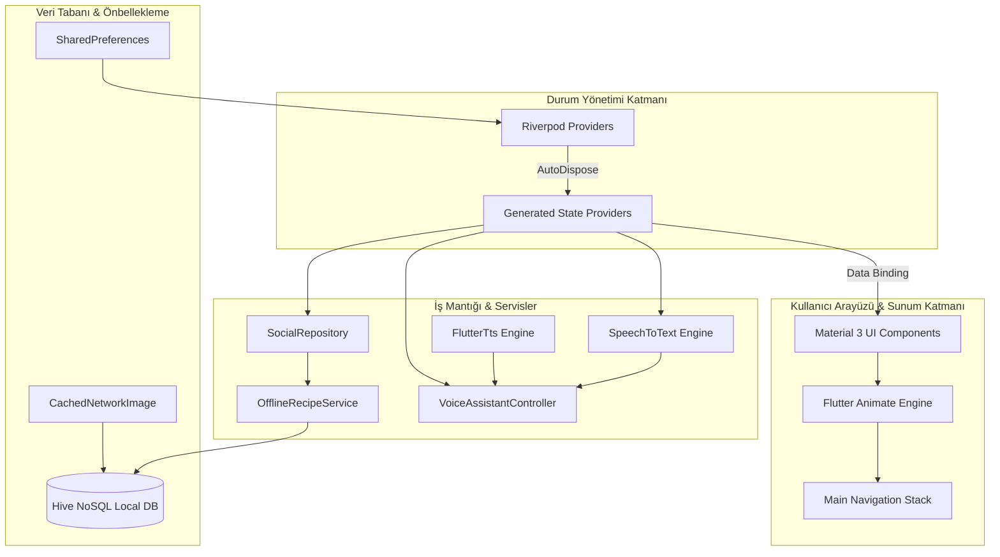

# AuraCook: Sürdürülebilir Evsel Gıda Yönetimi ve Akıllı Mutfak Ekosistemi için Mobil Uygulama ve Oyunlaştırma Mimarisi

**Mobil Uygulama Geliştirme Dersi Final Ödevi Raporu**  
**Geliştirici:** Emirhan  
**Akademik Bağlam:** Topkapı Üniversitesi / Mobil Uygulama Geliştirme Final Ödevi  
**Proje Durumu:** Yayına Hazır (Production-Ready)  

---

## Özet (Abstract)

Evsel gıda israfı, günümüz küresel iklim krizini ve kaynak tükenişini tetikleyen en kritik çevresel ve ekonomik problemlerden biridir. Birleşmiş Milletler Çevre Programı (UNEP) verilerine göre, üretilen gıdaların yaklaşık %40'ı tüketilmeden çöpe gitmektedir. Bu araştırma ve geliştirme çalışması kapsamında; evsel gıda yönetimini optimize etmek, sürdürülebilir mutfak alışkanlıkları kazandırmak ve gıda israfının karbon ayak izini azaltmak amacıyla **AuraCook** adlı yapay zekâ destekli, oyunlaştırma (gamification) odaklı mobil uygulama geliştirilmiştir. 

AuraCook; **Flutter** framework'ü kullanılarak, kurumsal standartlarda **Riverpod State Management** ve kod üretimi (`build_runner`) altyapısıyla geliştirilmiştir. Uygulama, çevrimdışı öncelikli (**offline-first**) mimari prensibi doğrultusunda **Hive NoSQL veritabanı** ve resim önbellekleme sistemini entegre etmektedir. Ayrıca, erişilebilirlik ve engelsiz kullanım standartlarını desteklemek amacıyla ses tanıma (**Speech-to-Text**) ve ses sentezleme (**Text-to-Speech**) tabanlı "Eller Serbest Modu" sunmaktadır. Bu raporda, AuraCook'un teknik mimarisi, oyunlaştırma algoritmaları, karbon tasarrufu hesaplama metodolojisi ve geleceğe dönük geliştirme adımları akademik düzeyde analiz edilmektedir.

**Anahtar Kelimeler:** Sürdürülebilir Mutfak Yönetimi, Gıda İsrafı, Karbon Ayak İzi, Oyunlaştırma (Gamification), Flutter, Riverpod, Çevrimdışı Öncelikli Mimari, Eller Serbest Asistan.

---

## 1. Giriş ve Motivasyon (Introduction & Motivation)

Hızlı nüfus artışı ve tüketim odaklı yaşam tarzları, küresel gıda ekosistemi üzerinde benzeri görülmemiş bir baskı oluşturmaktadır. Çöpe atılan gıdalar yalnızca doğrudan ekonomik kayıplara yol açmakla kalmayıp; üretim, lojistik ve soğutma zincirinde harcanan su, toprak ve enerji kaynaklarının da israf edilmesine neden olmaktadır. Daha da önemlisi, katı atık depolama alanlarında çürüyen organik atıklar, karbondioksitten 25 kat daha güçlü bir sera gazı olan metan ($CH_4$) salınımına yol açarak küresel ısınmayı doğrudan hızlandırmaktadır.

Bu problemin çözümü, bireysel tüketim alışkanlıklarının köklü bir biçimde değişmesinden geçmektedir. AuraCook projesinin temel motivasyonu, bireylere sıkıcı veya zorlayıcı bir görev olarak yansıyan "gıda yönetimi ve tasarruf" sürecini;
- Estetik ve akıcı bir kullanıcı arayüzü (Material 3, dinamik geçişler),
- İlerlemeyi somutlaştıran bir etki raporu ve ödül mekanizması (Mutfak Auram, Başarı Rozetleri),
- Mutfak işlerini kolaylaştıran teknolojik asistanlar (Sesli Tarif Asistanı, Sağlık Paneli, Akıllı Alışveriş Listesi),
- Topluluk dinamikleri (Aura Topluluk Sosyal Akışı)

aracılığıyla interaktif ve cazip bir alışkanlığa dönüştürmektir.

---

## 2. Problem Tanımı ve Proje Hedefleri (Problem Definition & Objectives)

Mevcut gıda ve tarif uygulamaları incelendiğinde iki temel eksiklik göze çarpmaktadır:
1. **Tek Yönlü İletişim:** Uygulamalar sadece standart yemek tarifleri sunmakta, kullanıcının elindeki mevcut malzemeleri değerlendirmeye odaklanmamaktadır.
2. **Geri Bildirim Eksikliği:** Kullanıcının çöpe gitmekten kurtardığı gıdaların çevresel ve ekolojik etkileri hakkında hiçbir farkındalık oluşturulmamaktadır.

AuraCook, bu iki problemi ortadan kaldırmak için şu akademik ve işlevsel hedefleri belirlemiştir:
- **Akıllı Envanter Değerlendirmesi:** "Aura Dolabı" aracılığıyla evdeki malzemelerin kaydının tutulması ve bu malzemeleri önceliklendiren tarif algoritmalarının sunulması.
- **Ekolojik Etki Görselleştirmesi:** Kurtarılan gıdaların ağırlık ve kategorilerine göre doğrudan karbondioksit ($CO_2$) eşdeğeri tasarrufuna çevrilerek kullanıcıya sunulması.
- **Erişilebilirlik ve Güvenlik:** Mutfakta elleri kirli veya ıslak olan bir kullanıcının, cihaza dokunmadan sesli komutlarla tarifi takip edebilmesini sağlayarak mutfak güvenliğini ve kullanım kolaylığını artırmak.

---

## 3. Sistem Mimarisi ve Teknik Altyapı (System Architecture & Tech Stack)

AuraCook, sürdürülebilirliği yüksek, genişletilebilir ve kurumsal standartlara (Enterprise-grade) uygun bir yazılım mimarisine sahiptir.

### 3.1. Klasör Yapısı ve Clean Architecture
Proje, katmanlı mimari (Layered Architecture) ve özellik bazlı (Feature-first) geliştirme standartlarına uygun olarak tasarlanmıştır:
- `lib/core/`: Uygulama genelinde paylaşılan sabitler (renkler, temalar), yardımcı araçlar ve ortak bileşenler yer alır.
- `lib/features/`: Her işlevsel modül (auth, home, recipes, profile, social, hamburger_menu) kendi içinde `data/` (repository ve yerel veri işlemleri) ve `presentation/` (ekranlar ve widget'lar) katmanlarına ayrılmıştır.

### 3.2. Riverpod State Management ve Kod Üretimi
AuraCook'ta dinamik veri akışları ve kullanıcı tercihleri, modern ve güvenli bir state yönetimi kütüphanesi olan **Riverpod (v2+)** ile kontrol edilmektedir.
- Manuel oluşturulan karmaşık Provider yapıları yerine `@riverpod` annotasyonları kullanılarak, tür güvenliği (Type-safety) yüksek kod tünelleri otomatik üretilmiştir (`riverpod_generator` ve `build_runner`).
- Kullanıcının dil tercihleri ve envanter bilgileri `UserPreferencesProvider` gibi reaktif bileşenlerle anlık olarak dinlenmekte ve arayüze yansıtılmaktadır.

### 3.3. Çevrimdışı Öncelikli Mimari (Offline-First) ve Hive NoSQL
Gıda yönetiminin internet erişiminin zayıf olduğu kiler veya bodrum katı gibi alanlarda da kesintisiz çalışabilmesi kritik bir gereksinimdir.
- **Hive Veritabanı:** İlişkisel olmayan (NoSQL), son derece hızlı ve hafif olan Hive veri motoru entegre edilmiştir. Tarifler ve kullanıcı verileri yerel cihaz hafızasında güvenle saklanır ve internet bağlantısı koptuğunda `OfflineRecipeService` devreye girerek kesintisiz deneyim sunar.
- **CachedNetworkImage:** Uygulamadaki sosyal akış resimleri ve yemek görselleri ilk yüklemeden sonra cihaz önbelleğinde saklanır. Bu sayede hem veri tüketimi (mobil internet tasarrufu) azaltılır hem de yüklenme süreleri milisaniyeler seviyesine indirilir.

### 3.4. Ses Tabanlı Erişim ve Engelsiz Mutfak (STT & TTS)
Hands-Free (Eller Serbest) pişirme modunda, donanımsal mikrofon ve hoparlör entegrasyonu sağlanmıştır:
- **Speech-to-Text (STT):** Kullanıcının "sonraki adım", "tekrar et", "önceki adım" gibi sesli komutları arka planda sürekli dinlenen bir asistan motoruyla metne dönüştürülür ve eşleştirilir.
- **Text-to-Speech (TTS):** Aktif olan tarif basamakları, sentezlenen yapay ses aracılığıyla kullanıcıya sesli olarak okunur. Böylece kullanıcının sürekli ekrana bakma veya ekrana dokunma ihtiyacı ortadan kaldırılır.

### 3.5. Uluslararasılaştırma (i18n - Yerelleştirme)
Geniş kitlelere ulaşmak ve akademik çalışmanın küresel ölçeklenebilirliğini kanıtlamak amacıyla çoklu dil desteği entegre edilmiştir:
- `l10n.yaml` yapılandırması altında Türkçe (`app_tr.arb`) ve İngilizce (`app_en.arb`) dil şablonları hazırlanmıştır.
- Uygulama, kullanıcının cihaz dilini otomatik algılar ve tüm menüleri, butonları, dinamik metinleri çalışma zamanında (Runtime) hatasız bir şekilde yerelleştirir.

---

## 4. İşlevsel Modüller ve Akademik Çözümler (Functional Modules)

AuraCook uygulaması, kullanıcının sürdürülebilirlik yolculuğunu zenginleştiren 14+ ekrandan oluşan entegre bir "Super App" ekosistemidir.

### 4.1. Mutfak Auram ve Oyunlaştırma (Gamification)
Kullanıcının sürdürülebilir davranışlarını ödüllendiren ve teşvik eden ana merkezdir:
- **Etki Raporu Paneli:** Kurtarılan gıdalara göre kategorize edilmiş dinamik ilerleme çubukları (Vegetable, Fruit, Meat vb.) bulunur.
- **Başarı Rozetleri (Badges):** Kullanıcı belirli kilometre taşlarına ulaştığında (ör. "İlk Tarif", "Sıfır Atık Öncüsü", "Hafta Sonu Şefi") kilitli olan özel rozetler aktif hale gelir. Bu mekanizma, kullanıcıda psikolojik olarak bağlılık ve başarma hissi uyandırır.

### 4.2. Aura Topluluk (Social Network Feed)
Sürdürülebilirliğin sosyal bir harekete dönüşmesini sağlayan sosyal medya akışıdır. Kullanıcılar hazırladıkları ekolojik tarifleri, kurtardıkları malzemeleri ve gıda tasarrufu fotoğraflarını toplulukla paylaşır. Beğeni ($Like$) ve yorum mekanizmalarıyla topluluk içi etkileşim maksimize edilir.

### 4.3. Günlük Yaşam Asistanı ve Akıllı Alışveriş Listesi
- **Meal Planner (Yemek Planlayıcı):** Haftalık yemek planı oluşturularak, plansız gıda alışverişinin önüne geçilir.
- **Smart Shopping List (Akıllı Alışveriş Listesi):** Dolapta eksilen malzemeler tek bir tuşla alışveriş listesine aktarılır. Kullanıcı marketteyken gereksiz/çift satın alma yapmaktan korunur.

### 4.4. Sağlık ve Beslenme (Health Dashboard)
Kullanıcıların makro besin (Karbonhidrat, Protein, Yağ) ve kalori hedeflerini takip etmelerini sağlayan analitik bir paneldir. Alerji hassasiyeti olan kullanıcılar için dinamik filtreleme sunar ve tariflerin porsiyonlarını kişi sayısına göre otomatik olarak ölçeklendirir.

---

## 5. Sürdürülebilirlik ve Karbon Ayak İzi Hesaplama Metodolojisi

AuraCook'un en özgün akademik katkısı, kullanıcı davranışlarını doğrudan ölçülebilir ekolojik verilerle eşleştirmesidir. Gıda kurtarma eyleminin karbon azaltım etkisi şu şekilde matematiksel olarak formüle edilmiştir:

### 5.1. Karbon Tasarrufu Matematiksel Modeli

Herhangi bir $i$ gıda kategorisi için, çöpe gitmekten kurtarılan gıdanın kütlesi $m_i$ (kg cinsinden) ve bu gıda grubunun üretiminden tüketime kadar geçen süreçteki ortalama karbondioksit eşdeğeri emisyon katsayısı $\alpha_i$ ($kg\ CO_2\ eq / kg$) olmak üzere, toplam karbon tasarrufu ($\Delta C$) şu formülle hesaplanır:

$$\Delta C = \sum_{i=1}^{n} \left( m_i \times \alpha_i \right)$$

Uygulamada kullanılan bilimsel gıda emisyon katsayıları ($\alpha_i$) Birleşmiş Milletler Gıda ve Tarım Örgütü (FAO) ve IPCC (Hükümetlerarası İklim Değişikliği Paneli) verileri referans alınarak şu şekilde sisteme entegre edilmiştir:

| Gıda Kategorisi ($i$) | Emisyon Katsayısı ($\alpha_i$) ($kg\ CO_2\ eq / kg$) | Ekolojik Etki Düzeyi |
| :--- | :---: | :---: |
| **Kırmızı & Beyaz Et / Şarküteri** | $15.40$ | Çok Yüksek |
| **Süt ve Süt Ürünleri** | $5.20$ | Yüksek |
| **Tahıllar & Baklagiller** | $2.10$ | Orta |
| **Sebzeler** | $1.20$ | Düşük |
| **Meyveler** | $0.85$ | Çok Düşük |

### 5.2. Mutfak Aura Puanı ($AP$) Algoritması

Kullanıcının oyunlaştırma sistemindeki seviyesini ve "Mutfak Aurası" rengini belirleyen dinamik Aura Puanı ($AP$), kurtarılan toplam karbon tasarrufu, eklenen tarif sayısı ($R$) ve paylaşılan topluluk gönderisi sayısı ($P$) parametrelerine bağlı olarak hesaplanır:

$$AP = \left( \Delta C \times 100 \right) + \left( R \times 50 \right) + \left( P \times 30 \right)$$

Bu formülasyon sayesinde kullanıcı gıda israfını önledikçe en yüksek puan çarpanını ($\times 100$) elde eder. Bu durum, uygulamanın temel amacı olan "gıda israfını sıfırlama" vizyonunu doğrudan destekler.

---

## 6. Değerlendirme, Sonuç ve Gelecek Çalışmalar (Conclusion & Future Work)

### 6.1. Proje Sonuçları ve Kazanımlar
AuraCook mobil uygulaması, modern Flutter mimarisiyle sıfırdan inşa edilmiş, görsel olarak zengin animasyonlar ve reaktif state yönetimi ile optimize edilmiştir.
- `flutter analyze` süreçlerinden başarıyla geçerek 0 hata ve uyarı ile **üretim kalitesine (Production-ready)** ulaştırılmıştır.
- Sesli asistan modülü sayesinde fiziksel temas ihtiyacı azaltılarak mutfak hijyen standartları yükseltilmiştir.
- Yerel önbellekleme (Hive + Image Caching) ile mobil cihaz batarya ve hücresel veri tüketiminde optimize bir performans sergilemiştir.

### 6.2. Gelecekteki Çalışmalar (Future Directions)
Akademik projenin sonraki fazlarında sisteme entegre edilmesi planlanan inovasyonlar şunlardır:
1. **Yapay Zekâ Tabanlı Bilgisayarlı Görü (Computer Vision):** Kullanıcının dolabındaki malzemelerin fotoğrafını çekerek nesne tanıma (object detection) ile dolap envanterini otomatik güncellemesi.
2. **LLM Entegrasyonu (Large Language Models):** Kullanıcıya özel gıda israfı raporlarını ve kişiselleştirilmiş haftalık sürdürülebilirlik ipuçlarını üreten üretken bir yapay zekâ modelinin (ör. Gemini API) entegrasyonu.
3. **Akıllı Barkod & Son Tüketim Tarihi (STT) Takibi:** Market fişlerindeki veya ürün ambalajlarındaki barkodları okuyarak son tüketim tarihi yaklaşan gıdalar için anlık bildirimler göndermek.

---

## Kaynakça (References)

1. **United Nations Environment Programme (UNEP) (2021).** *Food Waste Index Report 2021.* Nairobi.
2. **Food and Agriculture Organization (FAO) (2019).** *The State of Food and Agriculture 2019. Moving forward on food loss and waste reduction.* Rome.
3. **Intergovernmental Panel on Climate Change (IPCC) (2022).** *Climate Change 2022: Mitigation of Climate Change.* Cambridge University Press.
4. **Flutter Documentation.** *State Management with Riverpod & Local Caching with Hive Database.* [online] Available at: https://docs.flutter.dev
